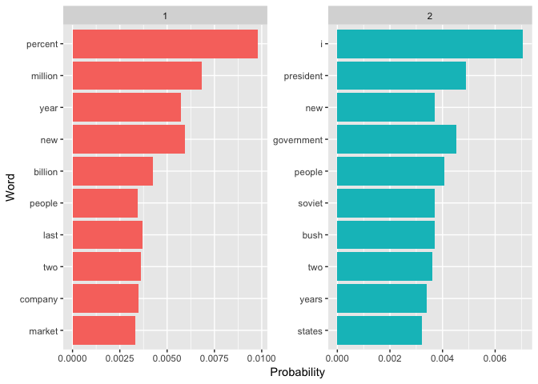
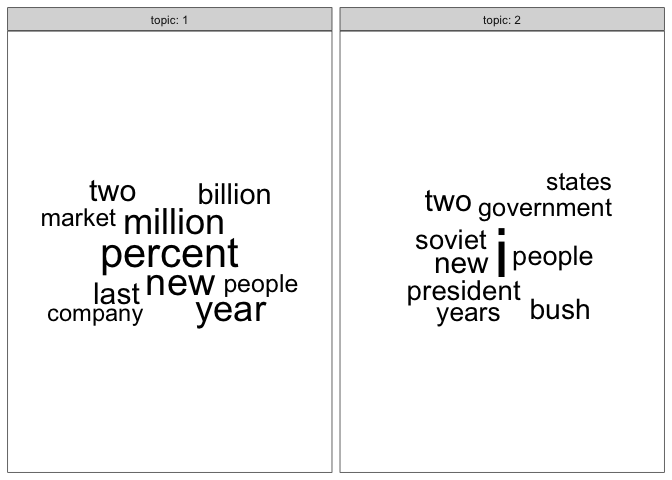

LDA Demo
================
Nazlı Özüm Kafaee
2019-04-22

In this demo, we will go through several applications provided in the online book [Text Mining with R](https://www.tidytextmining.com/index.html) by Julia Silge and David Robinson. Here, our language of choice is R and we will depend primarily on the [topicmodels package](https://cran.r-project.org/web/packages/topicmodels/index.html) and various other [tidyverse packages](https://www.tidyverse.org/packages/) listed below.

R Dependencies
--------------

``` r
library(topicmodels)
library(tidytext)
library(ggplot2)
library(dplyr)
library(ggwordcloud)
```

The Data
--------

The data we use in this demo is the `AssociatedPress` dataset provided in the `topicmodels` package. This dataset is a collection of 2246 news articles from an American news agency, mostly published around 1988. Let's load this dataset for our application.

``` r
data("AssociatedPress")
```

Implementation
--------------

### Fitting the LDA model

We can use the `LDA` function in the `topicmodels` package to apply to create an LDA model. The `k` setting within this function is used to determine the number of topics. For this specific example, we will use `k=2` to fit a two-topic LDA model.

``` r
# It is better to set a seed so that the output of the model is predictable
ap_lda <- LDA(AssociatedPress, k = 2, control = list(seed = 1234))
ap_lda
```

    ## A LDA_VEM topic model with 2 topics.

### Topic-word probabilities

By using the `tidy` function within the `tidytext` package, we can easily inspect the per-topic-per-word probabilities, *β* (representation might change based on source). Due to space limitation, we inspect the first 10 probabilities here.

``` r
ap_topics <- tidy(ap_lda)
head(ap_topics)
```

    ## # A tibble: 6 x 3
    ##   topic term          beta
    ##   <int> <chr>        <dbl>
    ## 1     1 aaron     1.69e-12
    ## 2     2 aaron     3.90e- 5
    ## 3     1 abandon   2.65e- 5
    ## 4     2 abandon   3.99e- 5
    ## 5     1 abandoned 1.39e- 4
    ## 6     2 abandoned 5.88e- 5

We can observe a one-topic-per-term-per-row format in the result above. Each word has a different probability given each topic. What does this mean? The word `aaron` has probability 1.686917*e* − 12 within the first topic and probability 3.895941*e* − 05 within the second topic. This means that there is a higher probability that an instance of the word `aaron` is generated by the second topic. A better way to interpret the difference between the two topics would be to inspect the top words within each topic.

``` r
ap_top_terms <- ap_topics %>%
  group_by(topic) %>%
  top_n(10, beta) %>%
  ungroup() %>%
  arrange(topic, desc(beta))

ap_top_terms %>%
  mutate(term = reorder(term, beta)) %>%
  ggplot(aes(term, beta, fill = factor(topic))) +
  geom_col(show.legend = FALSE) +
  facet_wrap(~ topic, scales = "free") +
  labs(y = "Probability", x = "Word") +
  coord_flip()
```



``` r
ggplot(ap_top_terms, aes(label = term, size = beta), color = topic) +
  facet_wrap(~ topic, labeller = "label_both") +
  geom_text_wordcloud_area(shape = "square", area_corr_power = 1) +
  scale_size_area(max_size = 18) +
  theme_bw()
```



The visualizations above show that the most common words in topic 1 include “percent”, “million”, “year”, and “new", hinting that the topic might be related to business, finance, etc. Thoe words that are most common in topic 2 include “president”, “government”, and “soviet”, suggesting that this topic holds news related to politics. One important observation is that some words such as “new”, "two" and “people” are common within both topics. This points out to an important characteristic of LDA that sets it apart from discrete clustering methods. The topics in the LDA model resemble the topics used in natural language could have some overlap in terms of words.

### Document-topic probabilities

In the LDA model, each document has a topic distribution. We can examine the per-document-per-topic probabilities, *γ* (representation might change based on source), as shown below. Again, due to space limitation, we will inspect the probabilities within the first three document here.

``` r
ap_documents <- tidy(ap_lda, matrix = "gamma") %>% arrange(topic)
head(ap_documents %>% arrange(document))
```

    ## # A tibble: 6 x 3
    ##   document topic gamma
    ##      <int> <int> <dbl>
    ## 1        1     1 0.248
    ## 2        1     2 0.752
    ## 3        2     1 0.362
    ## 4        2     2 0.638
    ## 5        3     1 0.527
    ## 6        3     2 0.473

The probabilities above show the estimated proportion of words from that document that are generated from that topic. For example, the model estimates that only about 75% of the words in document 1 were generated from topic 2.

References
==========

Silge, Julia, and David Robinson. 2016. “tidytext: Text Mining and Analysis Using Tidy Data Principles in R.” JOSS 1 (3). The Open Journal. <https://doi.org/10.21105/joss.00037>.
